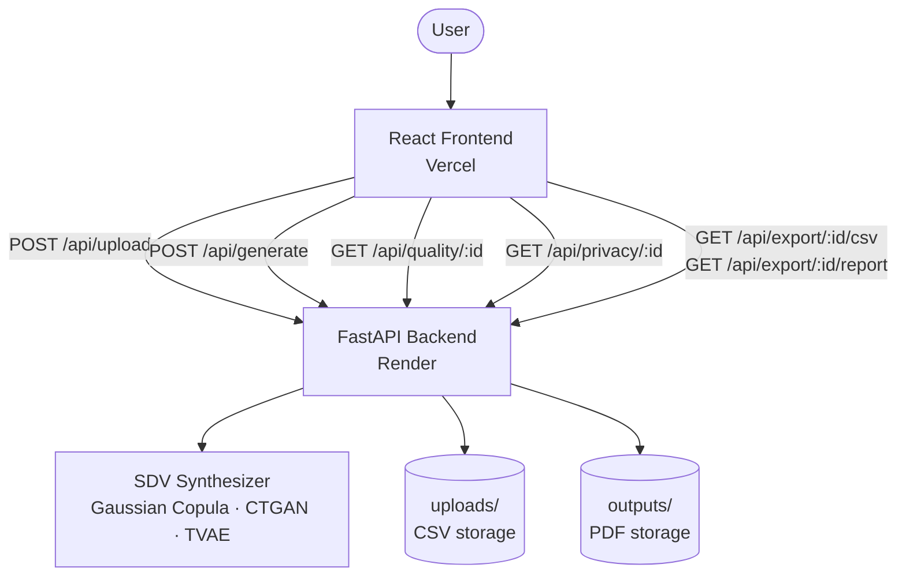

# DataForge AI

Generate realistic synthetic datasets from your real data — with quality scoring, privacy risk analysis, and one-click PDF export.

---
## Live Demo

**Frontend:** https://dataforge-ai-gold.vercel.app  
**Backend API:** https://dataforge-ai-backend-ezxl.onrender.com/docs

> **Note:** The live demo runs on Render's free tier (512MB RAM). Only **Gaussian Copula** is available in the deployed version. CTGAN and TVAE require significantly more memory due to their PyTorch dependency and are available when running locally.
>
> The free tier also spins down after inactivity — the first request may take 30–60 seconds to wake up.

---

## Architecture



---

## Features

- **Dataset health scoring** — missing values, duplicates, outliers, and class imbalance scored out of 100
- **Three synthesizers** — Gaussian Copula (fast, numerical), CTGAN (mixed types), TVAE (large complex datasets)
- **Auto-recommendation** — synthesizer selected automatically based on dataset size and column types
- **Quality metrics** — Jensen-Shannon divergence, KS test, mean/std comparison, and correlation matrix similarity per column
- **Privacy metrics** — duplicate rate, nearest-neighbour distance, attribute disclosure risk, and re-identification score
- **PDF report export** — full summary report with metrics and column distribution charts

---

## Tech Stack

| Layer | Technology |
|---|---|
| Frontend | React 19, Vite, Tailwind CSS v4, Recharts, Axios |
| Backend | Python, FastAPI, Uvicorn, Pydantic v2 |
| ML / Synthesis | SDV (GaussianCopulaSynthesizer, CTGANSynthesizer, TVAESynthesizer), scikit-learn, SciPy |
| Export | fpdf2, Matplotlib |

---

## Project Structure

```
dataforge-ai/
├── backend/
│   ├── app/
│   │   ├── main.py
│   │   ├── config.py
│   │   ├── models/
│   │   ├── routers/
│   │   ├── services/
│   │   └── utils/
│   ├── tests/
│   ├── requirements.txt
│   └── render.yaml
└── frontend/
    ├── src/
    │   ├── pages/
    │   └── services/
    ├── vercel.json
    └── package.json
```

---

## Running Locally

### Backend

```bash
cd backend
python -m venv venv
source venv/bin/activate        # Windows: venv\Scripts\activate
pip install -r requirements.txt
uvicorn app.main:app --reload
```

Backend runs at `http://localhost:8000`. Swagger docs at `http://localhost:8000/docs`.

### Frontend

```bash
cd frontend
npm install
npm run dev
```

Frontend runs at `http://localhost:5173`. Create a `.env` file in `frontend/`:

```
VITE_API_URL=http://localhost:8000
```

---

## API Endpoints

| Method | Path | Description |
|---|---|---|
| `GET` | `/` | Health check |
| `POST` | `/api/upload/` | Upload a CSV — returns file ID, column types, health score, and synthesizer recommendation |
| `POST` | `/api/generate/` | Fit a synthesizer on the uploaded data and generate synthetic rows |
| `GET` | `/api/quality/{file_id}` | Compute quality metrics comparing real vs synthetic distributions |
| `GET` | `/api/privacy/{file_id}` | Compute privacy risk metrics for the synthetic dataset |
| `GET` | `/api/export/{file_id}/csv` | Download the synthetic dataset as a CSV file |
| `GET` | `/api/export/{file_id}/report` | Generate and download a full PDF summary report |

---

## Known Limitations

- **No session persistence** — uploaded files are identified by a UUID that lives only as long as the server process. A Render restart clears all uploads and outputs.
- **No authentication** — any client that knows a `file_id` can access, generate from, or export that file. Do not upload sensitive data in production without adding auth.
- **NN distance underestimates privacy risk on large datasets** — when training data is large, synthetic rows are statistically close to real ones by nature, which compresses the normalized distance score toward 0 regardless of actual privacy.
- **SDV `SingleTableMetadata` deprecation warning** — current SDV versions emit a warning recommending migration to the `Metadata` class. This is non-breaking and will be addressed in a future version.
- **CTGAN / TVAE unreliable on very small datasets** — fewer than ~100 rows provides insufficient training signal; generated values may be outside realistic ranges.
- **No file cleanup** — `uploads/` and `outputs/` grow indefinitely. Add a scheduled cleanup job or use object storage (e.g. S3) for production use.
- **Generation time scales with data size and synthesizer** — TVAE on 10,000+ rows can take 2–3 minutes. Expect timeouts on Render's free tier for large jobs.
- **CTGAN and TVAE unavailable on free tier** — both synthesizers depend on PyTorch (~1.5GB RAM on load), which exceeds Render's free tier limit of 512MB. The deployed demo uses Gaussian Copula only. Run locally to access all three synthesizers.

---

## Deployment

### Backend — Render

1. Connect your repo to [Render](https://render.com) and create a new **Web Service**.
2. Set **Root Directory** to `backend`.
3. Set **Build Command** to `pip install -r requirements.txt`.
4. Set **Start Command** to `uvicorn app.main:app --host 0.0.0.0 --port 8000`.
5. Add the following environment variables in the Render dashboard:

| Key | Value |
|---|---|
| `UPLOAD_DIR` | `uploads` |
| `REPORT_DIR` | `outputs` |
| `MAX_UPLOAD_SIZE_MB` | `50` |
| `DEFAULT_SYNTHESIZER` | `auto` |
| `RANDOM_SEED` | `42` |

### Frontend — Vercel

1. Connect your repo to [Vercel](https://vercel.com) and import the project.
2. Set **Root Directory** to `frontend`.
3. Add the following environment variable in the Vercel dashboard:

| Key | Value |
|---|---|
| `VITE_API_URL` | `https://your-service-name.onrender.com` |

The `vercel.json` at `frontend/vercel.json` handles SPA routing and proxies `/api/*` requests to the Render backend automatically.
