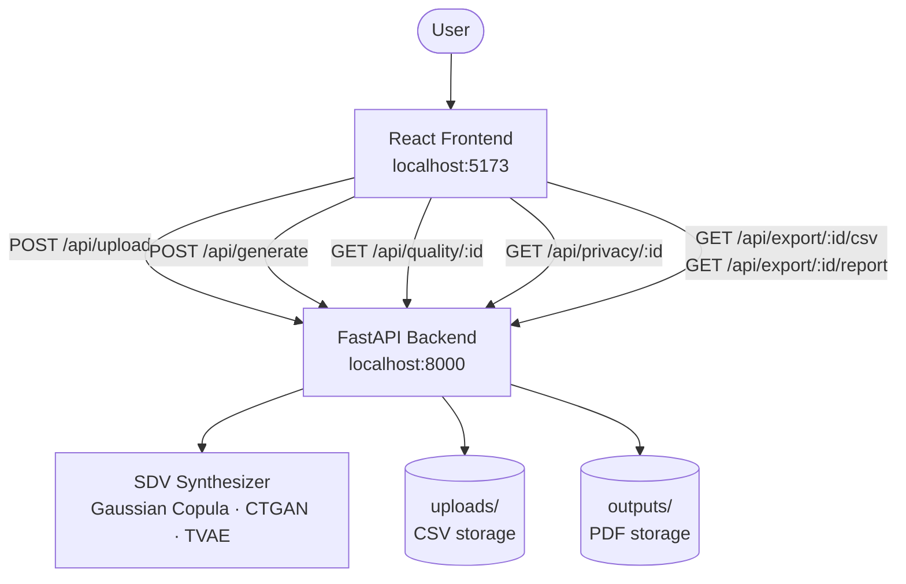

# DataForge AI — Local (Full Version)

Generate realistic synthetic datasets from your real data — with quality scoring, privacy risk analysis, and one-click PDF export.

> **You are on the `local` branch** — this includes all three synthesizers: Gaussian Copula, CTGAN, and TVAE.  
> For the live demo, see the `main` branch or visit https://dataforge-ai-gold.vercel.app

---

## Architecture



---

## Features

- **Dataset health scoring** — missing values, duplicates, outliers, and class imbalance scored out of 100
- **Three synthesizers** — Gaussian Copula (fast, numerical), CTGAN (mixed types), TVAE (large complex datasets)
- **Auto-recommendation** — synthesizer selected automatically based on dataset size and column types
- **Quality metrics** — Jensen-Shannon divergence, KS test, mean/std comparison, and correlation matrix similarity per column
- **Privacy metrics** — duplicate rate, nearest-neighbour distance, attribute disclosure risk, and re-identification score
- **PDF report export** — full summary report with metrics and column distribution charts

---

## Tech Stack

| Layer | Technology |
|---|---|
| Frontend | React 19, Vite, Tailwind CSS v4, Recharts, Axios |
| Backend | Python, FastAPI, Uvicorn, Pydantic v2 |
| ML / Synthesis | SDV (GaussianCopulaSynthesizer, CTGANSynthesizer, TVAESynthesizer), scikit-learn, SciPy |
| Export | fpdf2, Matplotlib |

---

## Project Structure

dataforge-ai/
├── backend/
│ ├── app/
│ │ ├── main.py
│ │ ├── config.py
│ │ ├── models/
│ │ ├── routers/
│ │ ├── services/
│ │ └── utils/
│ ├── tests/
│ ├── requirements.txt
│ └── render.yaml
└── frontend/
├── src/
│ ├── pages/
│ └── services/
├── vercel.json
└── package.json

---

## Running Locally

### Backend

```bash
cd backend
python -m venv venv
source venv/bin/activate        # Windows: venv\Scripts\activate
pip install -r requirements.txt
uvicorn app.main:app --reload
```

Backend runs at `http://localhost:8000`.  
Swagger docs at `http://localhost:8000/docs`.

### Frontend

```bash
cd frontend
npm install
npm run dev
```

Frontend runs at `http://localhost:5173`.

Create a `.env` file inside `frontend/`:

VITE_API_URL=http://localhost:8000

---

## API Endpoints

| Method | Path | Description |
|---|---|---|
| `GET` | `/` | Health check |
| `POST` | `/api/upload/` | Upload CSV — returns file ID, column types, health score, synthesizer recommendation |
| `POST` | `/api/generate/` | Fit synthesizer and generate synthetic rows |
| `GET` | `/api/quality/{file_id}` | Quality metrics comparing real vs synthetic distributions |
| `GET` | `/api/privacy/{file_id}` | Privacy risk metrics for the synthetic dataset |
| `GET` | `/api/export/{file_id}/csv` | Download synthetic dataset as CSV |
| `GET` | `/api/export/{file_id}/report` | Generate and download full PDF summary report |

---

## Synthesizer Guide

| Synthesizer | Best For | Memory Required |
|---|---|---|
| Gaussian Copula | Small to medium datasets, mostly numerical | ~200MB |
| CTGAN | Mixed numerical + categorical, medium datasets | ~1.5GB (PyTorch) |
| TVAE | Large datasets with complex distributions | ~1.5GB (PyTorch) |

> CTGAN and TVAE require PyTorch. On machines with less than 2GB available RAM, use Gaussian Copula or the Auto mode which will select it automatically for smaller datasets.

---

## Known Limitations

- **No session persistence** — uploaded files are identified by UUID and cleared on server restart
- **No authentication** — any client with a `file_id` can access that file
- **NN distance underestimates privacy risk on large datasets** — synthetic rows are statistically close to real ones by nature at scale
- **SDV `SingleTableMetadata` deprecation warning** — non-breaking, will migrate to `Metadata` class in a future version
- **CTGAN / TVAE unreliable on very small datasets** — fewer than ~100 rows produces unrealistic values
- **No file cleanup** — `uploads/` and `outputs/` grow indefinitely
- **TVAE underestimates feature variance** — generated distributions are narrower than the original; a known VAE characteristic
- **Generation time scales with data size** — TVAE on 10,000+ rows can take 2–3 minutes